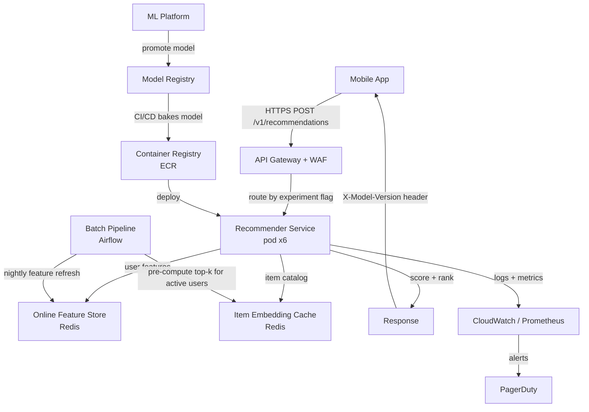

# Architecture

## System Diagram

## Component Descriptions

**API Gateway** — AWS API Gateway with WAF rules. Handles auth, rate limiting and experiment flag injection. Routes traffic to different model versions for A/B tests.

**Recommender Service** — Stateless Python (FastAPI) pods running on ECS/Fargate or EKS. Each pod loads the two-tower model from the baked image on startup. Fetches user features from Redis, runs dot-product scoring against pre-computed item embeddings, returns top-N results.

**Online Feature Store (Redis)** — Stores the last-30-day user feature vectors. TTL of 24h, refreshed by the nightly Airflow pipeline. Cold-start users get a popularity vector instead.

**Item Embedding Cache (Redis)** — Pre-computed item embeddings. Refreshed when a new model version is deployed.

**Model Registry** — MLflow registry (self-hosted or managed). Stores model artifacts, metrics, lineage, and approval status.

**Batch Pipeline** — Airflow DAG running nightly. Refreshes user features from the data warehouse and pre-computes top-K candidates for active users.
