# Model Lifecycle

## End-to-End Diagram

```mermaid
flowchart LR
    A[Data Collection\nClickstream + purchases] --> B[Feature Engineering\nAirflow DAG]
    B --> C[Model Training\nSageMaker / EC2 spot]
    C --> D[Offline Evaluation\nAUC, NDCG@10, coverage]
    D -->|fails threshold| C
    D -->|passes| E[Register Candidate\nMLflow staging]
    E --> F[Shadow Test\n1% traffic, no UI impact]
    F --> G[ML Lead Review\nmetrics + drift check]
    G -->|rejected| C
    G -->|approved| H[Promote to production\nMLflow production tag]
    H --> I[CI builds new image\nrecommender:git-sha-vX.Y.Z]
    I --> J[Deploy to staging\nsmoke test]
    J -->|fails| K[Rollback + page on-call]
    J -->|passes| L[Canary deploy\n10% prod traffic]
    L --> M[Monitor 30 min\nlatency + error rate + CTR]
    M -->|regression| K
    M -->|green| N[Full rollout\n100% traffic]
    N --> O[Monitor ongoing\ndrift alerts, burn-rate]
    O -->|drift detected| P[Trigger retraining]
    P --> C
```

## Stage Descriptions

| Stage | Owner | Exit Criteria |
|---|---|---|
| Feature engineering | Data engineering | All features available in feature store with < 1h lag |
| Training | ML engineer | Runs clean, no OOM, training loss converges |
| Offline eval | ML engineer | NDCG@10 ≥ 0.38, AUC ≥ 0.82, coverage ≥ 60% |
| Shadow test | ML ops | p95 latency < 100 ms in shadow, no errors |
| ML lead review | ML lead (sign-off required) | Manual approval in MLflow UI |
| Staging smoke test | CI/CD (automated) | 200 OK on `/health`, 5 sample predictions look sane |
| Canary | On-call engineer | p95 < 120 ms, error rate < 0.5%, CTR not worse than baseline for 30 min |
| Full rollout | On-call engineer | Manual confirmation |

## Retraining Trigger

Retraining is triggered automatically when the **feature drift alert** fires (see `monitoring/alerts.yaml`), or on a fixed weekly schedule whichever comes first.
